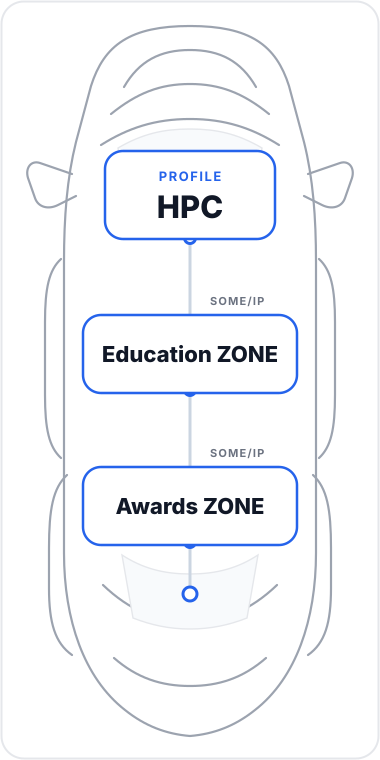

<table>
<tr>

<td width="270">

</td>

<td>

# Wang Jaepil

### 🔬 Automotive Embedded Software Engineer

---

## 🎓 Education ZONE

- **🏫 Incheon National University** — B.S. in Embedded Systems Engineering (2026.02)
  
- **📖 Hyundai AutoEver Mobility Embedded SW School** — (2026.06)

---

## 🏆 Awards ZONE & Activities

- 🏎️ **2025 · HL FMA 자율주행 경진대회** — 센서 통합 기반 유아전동차 자율주행 — **장려상**
- 🥇 **2025 · 캡스톤디자인** — 클라이밍 초보자를 위한 레이저 길안내 시스템 — **최우수상**
- 🤖 **2025 · SK NAMUX** — 자율주행 스마트 공기청정기 활용 아이디어 제안 — **본선진출**
- ⚙️ **2026 · 임베디드 sw 모빌리티 경진대회** — 사용자 맞춤형 차량 설정 시스템
- 🔧 **2026 · KDT 해커톤 8회** — AI 음향 인식 기반 산업안전 웨어러블 시스템
- 🥇 **2026 · 차량용 통신 시스템** — 스토어형 차량용 OTA 서비스 — **우수 프로젝트상(1등)**
- 🥇 **2026 · 자율주행 기능 구현** — 주차 보조 시스템 및 자동출차 — **우수 프로젝트상(1등)**
</td>

</tr>
</table>
