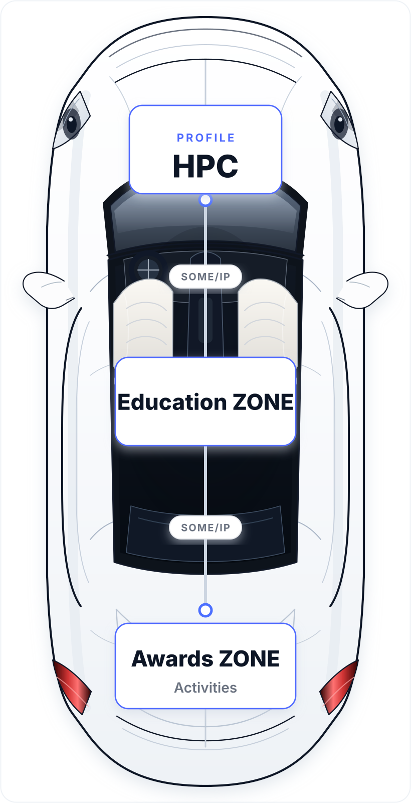

<table>
<tr>
<td width="30%" valign="top">

</td>
<td width="70%" valign="top">

<h1>Wang Jaepil</h1>

<b>🔬 Automotive Embedded Software Engineer</b>

<h2>🎓 Education ZONE</h2>

🏫 <b>Incheon National University</b> 
&nbsp;&nbsp;&nbsp;&nbsp;↳ B.S. in Embedded Systems Engineering · 2026.02

📖 <b>Hyundai AutoEver Mobility SW School</b> 
&nbsp;&nbsp;&nbsp;&nbsp;↳ Automotive Embedded Software · 2026.06

<h2>🏆 Awards ZONE & Activities</h2>

🏎️ <b>2025 · HL FMA 자율주행 경진대회</b> 
&nbsp;&nbsp;&nbsp;&nbsp;↳ 센서 통합 기반 유아전동차 자율주행 · <b>장려상</b>

🥇 <b>2025 · 캡스톤디자인</b> 
&nbsp;&nbsp;&nbsp;&nbsp;↳ 클라이밍 초보자를 위한 레이저 길안내 시스템 · <b>최우수상</b>

🤖 <b>2025 · SK 인텔릭스 NAMUX</b> 
&nbsp;&nbsp;&nbsp;&nbsp;↳ 자율주행 스마트 공기청정기 활용 아이디어 제안 · <b>본선 진출</b>

⚙️ <b>2026 · 임베디드 SW 모빌리티 경진대회</b> 
&nbsp;&nbsp;&nbsp;&nbsp;↳ 사용자 맞춤형 차량 설정 시스템

🔧 <b>2026 · 제8회 KDT 해커톤</b> 
&nbsp;&nbsp;&nbsp;&nbsp;↳ AI 음향 인식 기반 산업안전 웨어러블 시스템

🥇 <b>2026 · 차량용 통신 시스템 프로젝트</b> 
&nbsp;&nbsp;&nbsp;&nbsp;↳ 스토어형 차량용 OTA 서비스 · <b>우수 프로젝트상 (1등)</b>

🥇 <b>2026 · 자율주행 기능 구현 프로젝트</b> 
&nbsp;&nbsp;&nbsp;&nbsp;↳ 주차 보조 시스템 및 자동출차 · <b>우수 프로젝트상 (1등)</b>

</td>
</tr>
</table>
